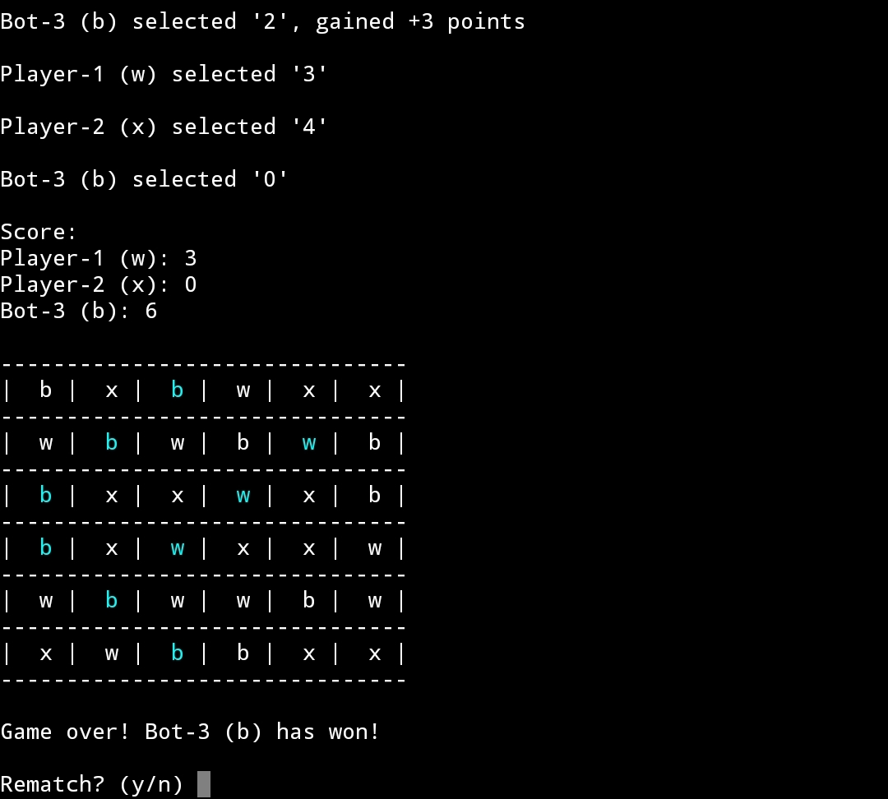

Created this simple Tic-Tac-Toe game entirely on my phone during class breaks. It's been tested on Android, and it should work on other OSes too, although the formatting might not align perfectly. All codes are packed into a single file, requiring only a compiler — atleast C++17 — to compile and run the `main.cpp` file.

To spice things up, there's a bot that's challenging but not impossible to beat. The bot will only evaluate their current move without looking ahead the next move. Although there's a plan to make it evaluate one move ahead, the bot still plays in both offensive and defensive manner.

#### Features:
- Classic mode which expands to the number of player,
- Frenzy mode to score as much as possible,
- Customizable grid size for Frenzy mode,
- A challanging yet beatable bot,
- Extensive number of players to create.